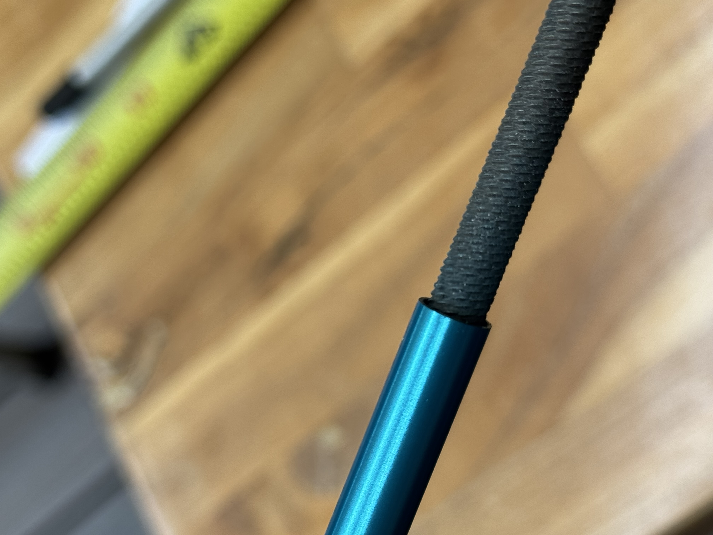

# Element construction - Overview

There are three dipoles (elements):
1. Director Dipole. Based on Cebik medium duty design, this dipole is 191 inches long. A half element is 95.5 inches long. (Prototype half dipole is 95 inches.)
2. Forward-fed Dipole (Driver 2 or D2) 194 inches long, half is 97. (Prototype half dipole is 100.25 inches.)
3. Rear-fed Dipole (Driver 1 or D1) 206 inches long, half is 103. (Prototype half dipole is 108.5 inches.)

For sources of materials for antenna elements, see [Bill of materials](Bill-of-materials.md)

## Connectors
1. Connector 1: Online Metals 1/4 inch OD, 0.035 inch thick aluminum tube cut to 4 inches
2. Connector 2: Online Metals 1/4 inch OD, 0.035 inch thick aluminum tube cut to 3 inches

## Shims

1. Shim 1: Copper tape shim, cut to 2 inches
2. Shim 2: Copper tape shim, cut to 4 inches (for Connector 1)
3. Shim 3: Copper tape shim, cut to 3 inches (for Connector 2)
4. Shim 4: Copper sheet cut to 1.25 inch by 0.25 inch lengths
 
## Element Segments

Table 1. Element lengths for modified Cebik antenna. All dimensions are in inches. Two inches of the Mid 1 segments overlaps with the root tubes. The tip tubes are used for tuning and can slide into the Mid 3 segments to vary the dipole lengths. 
| Dipole	| Root	| Mid 1	| Mid 2	| Mid 3	| Tip |
|-----------|--------|------|-------|-------|-----|
| Director	| 13.5	 | 30	| 30	| 15	| 12  |
| Driven 2	| 14.5	 | 30	| 30	| 16	| 12  |
| Driven 1	| 14.5	 | 30	| 30	| 25	| 12  |

There are 4 segments in each half of the Director dipole. All "Mid" segments are arrow shafts. The root tube is a tent pole. The tip tube is a smaller diameter aluminum tube that slides inside the last arrow shaft.

1. Root segment (tent pole): Cut to 13.5 inches
2. Mid 1 segment (arrow shaft): Keep original length at 30 inches. Two inches of the root side is stripped and covered with 4 sheets of Shim 1 and slides into the tent pole.
3. Mid 2 segment (arrow shaft): Keep original length at 30 inches. This connects to Mid 1 using Connector 1 which is covered with Shim 2. Connector 1 has a 2 inch overlap on each side.   
4. Mid 3 segment (arrow shaft): Cut to 15 inches. This connects to Mid 2 using Connector 2. Connector 2 is covered with 1 and 1/3 sheets of Shim 3 before sliding Mid 3 and Mid 2 over it. Connector 2 has 1.5 inch overlap on each side. 
5. Tip segment (6 mm K&S aluminum tube): Cut to 12 inches. This slides into Mid 3 using Shim 1. This will be the tuning tube, all others are fixed. See Cebik antenna element lengths table below.

## Forward-fed Dipole

There are 4 segments in each half of the Forward-fed dipole. All "Mid" segments are arrow shafts. The root tube is a tent pole. The tip tube is an aluminum tube that slides inside the last arrow shaft.

1. Root segment (tent pole): Cut to 14.5 inches
2. Mid 1 segment (arrow shaft): Keep original length at 30 inches. Two inches of the root side is stripped and covered with 4 sheets of Shim 1 and slides into the tent pole.
3. Mid 2 segment (arrow shaft): Keep original length at 30 inches. This connects to Mid 1 using Connector 1 which is covered with Shim 2. Connector 1 has a 2 inch overlap on each side.   
4. Mid 3 segment (arrow shaft): Cut to 15.5 inches. This connects to Mid 2 using Connector 2. Connector 2 is covered with 1 and 1/3 sheets of Shim 3 before sliding Mid 3 and Mid 2 over it. Connector 2 has 1.5 inch overlap on each side. 
5. Tip segment (6 mm K&S aluminum tube): Cut to 12 inches. This slides into Mid 3 using Shim 1. This will be the tuning tube, all others are fixed. See Cebik antenna element lengths table below.

## Rear-fed Dipole

There are 5 segments in each half of the Rear-fed dipole. All "Mid" segments are arrow shafts. The root tube is a tent pole. The tip tube is an aluminum tube that slides inside the last arrow shaft.

1. Root segment (tent pole): Cut to 14.5 inches
2. Mid 1 segment (arrow shaft): Keep original length at 30 inches. Two inches of the root side is stripped and covered with 4 sheets of Shim 1 and slides into the tent pole.
3. Mid 2 segment (arrow shaft): Keep original length at 30 inches. This connects to Mid 1 using Connector 1 which is covered with Shim 2. Connector 1 has a 2 inch overlap on each side.   
4. Mid 3 segment (arrow shaft): Cut to 18.5 inches. This connects to Mid 2 using Connector 2. Connector 2 is covered with 1 and 1/3 sheets of Shim 3 before sliding Mid 3 and Mid 2 over it. Connector 2 has 1.5 inch overlap on each side. 
5. Tip segment (6 mm K&S aluminum tube): Cut to 12 inches. This slides into Mid 3 using Shim 1. This will be the tuning tube, all others are fixed. See Cebik antenna element lengths table below.

# Preparing elements and Connectors

## Burring and stripping

1. Burr the insides of both ends of arrow shafts

2. Test that the burring created a conductive path for connectors to work.

3. Do the same for the element side of the root tube, the tent pole. One inch of the boom side of the tent pole is stripped. Test connections as well. 
4. Strip 2 inches from one end of each Mid 1 segment (arrow shaft) to ensure proper fit into the tent pole root segment.

## Stripping

1. Strip 2 inches from the root end of each Mid 1 segment (arrow shaft) to create a snug fit inside the tent pole
2. Apply 4 sheets of Shim 1 (copper tape) around the stripped section before insertion
3. Test fit all connections to ensure electrical continuity before final assembly
4. Mark the insertion depth on each segment to ensure consistent assembly

