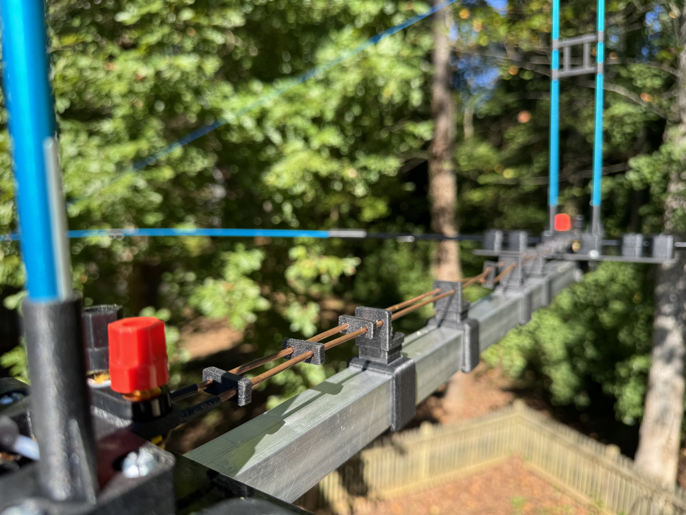

# Phased array configuration

The phased array is based on the Cebik antenna described in the [References](References.md) section. Follow wire specs, spaving and building instructions closely.

**Figure 1.** Phasing harness on the antenna boom. Note the half-twist somewhere in the middle.  
