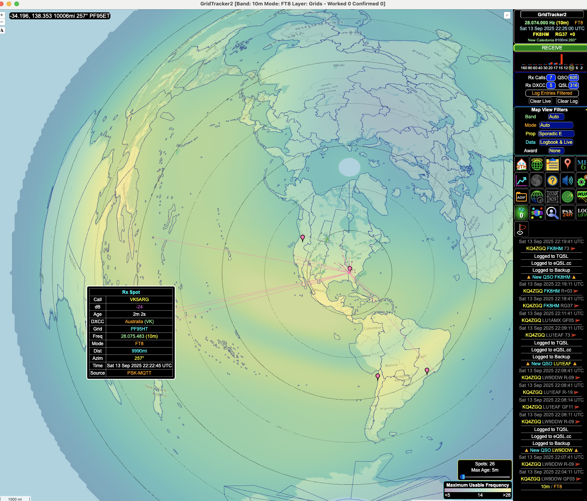
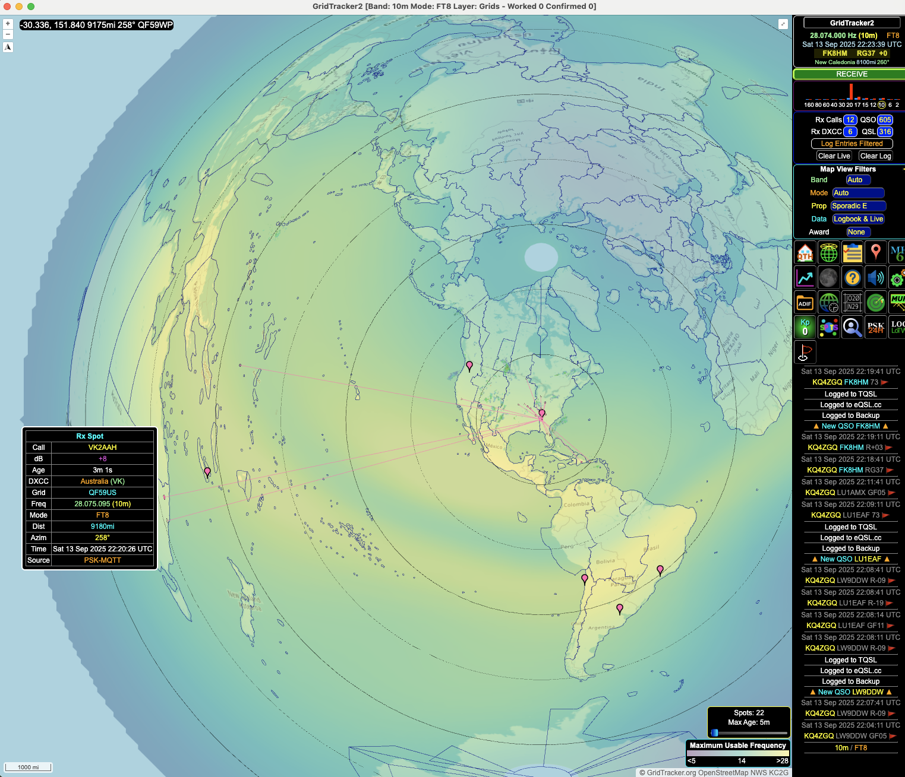
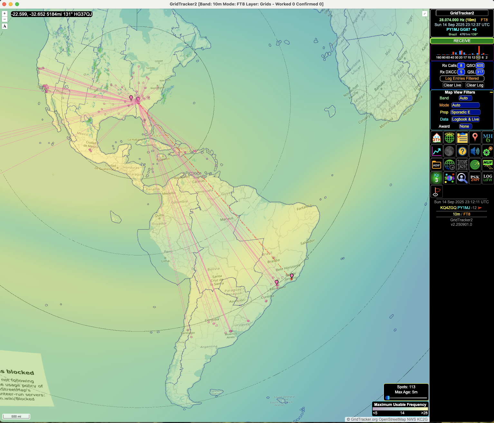
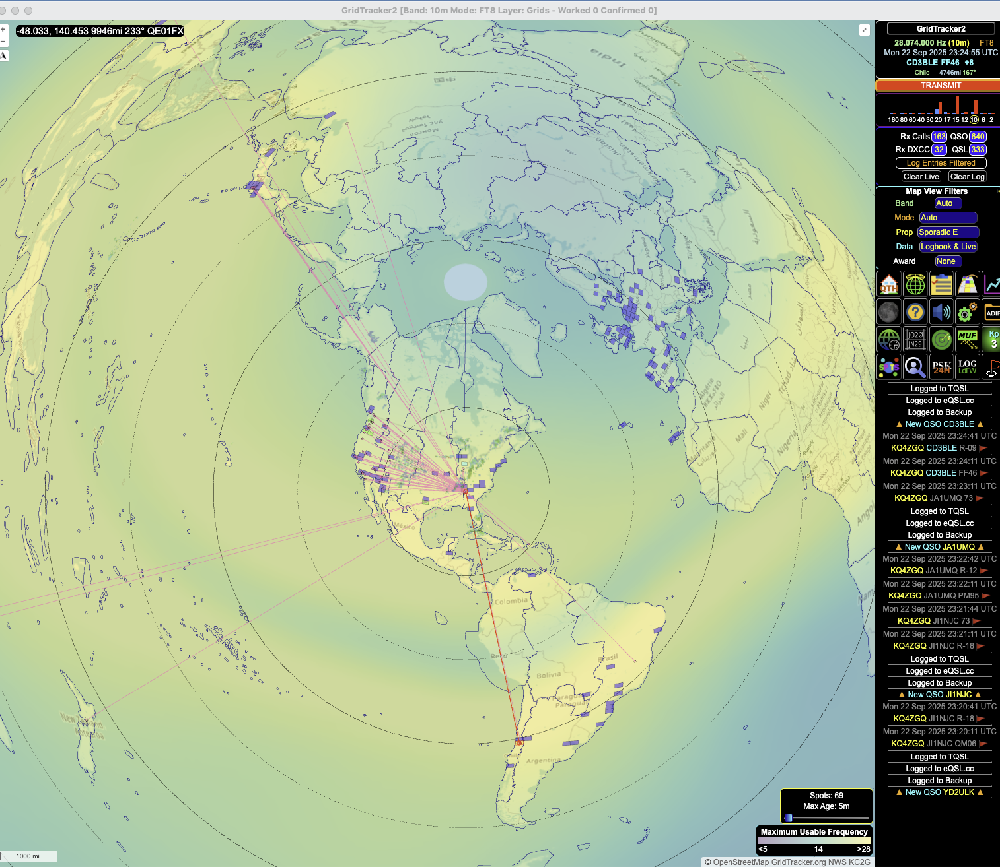
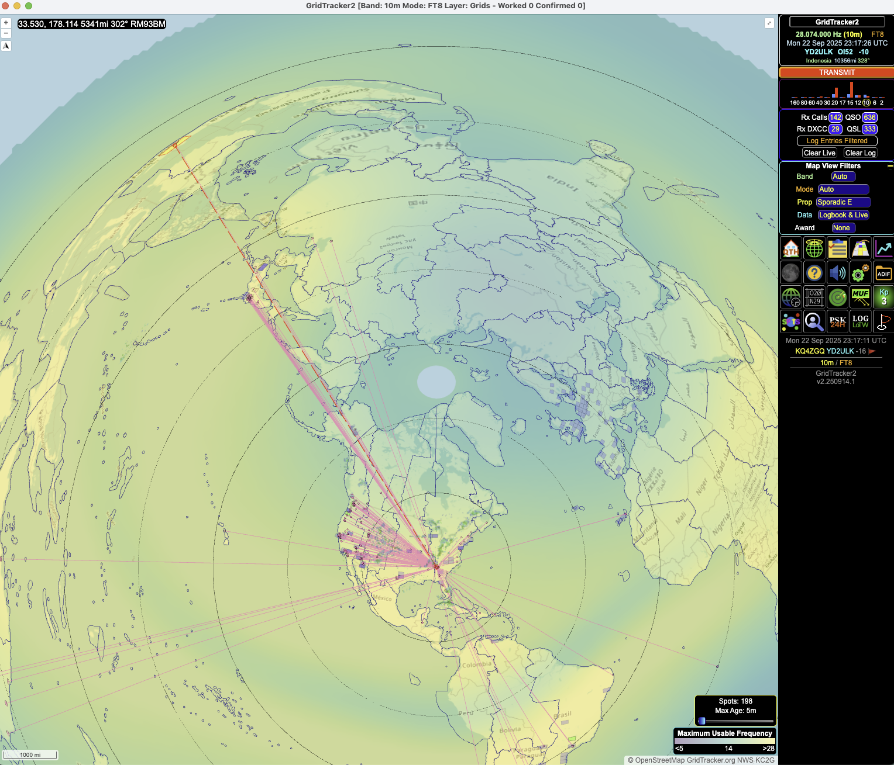
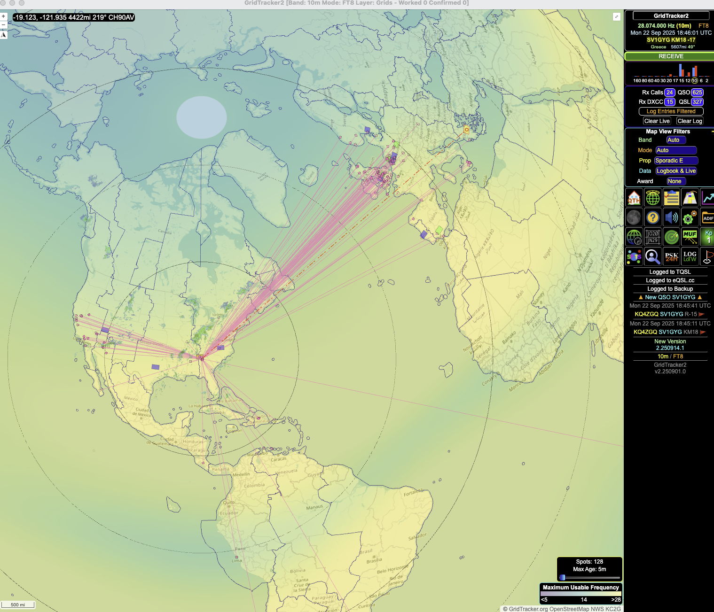
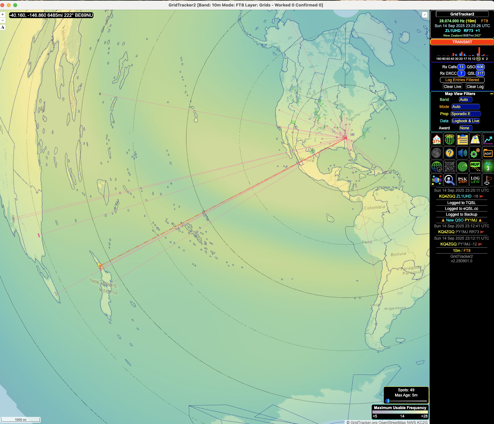

# Testing

## Test details

1. Antenna: 10m 3-element phased array Yagi (Cebik compact design)
2. Antenna height: On mast 162+150 inches AGL
3. Radio: Yaesu FT991A

## GridTracker2 FT8 Screenshots

### Australia

Figure 1. 250 degrees azimuth, 35w

Figure 2. 250 degrees azimuth, 60w

### Brazil

Figure 3. 150 degrees azimuth, 50w

### Indonesia, Japan, Chile

Figure 4. Multiple QSOs at 330 degrees azimuth, 100w

### Greece

Figure 5. 40 degrees azimuth, 100w

### New Zealand

Figure  6. 240az at 100w

## WSJT-X QSOs

Figure 6. WSJT-X QSOs

