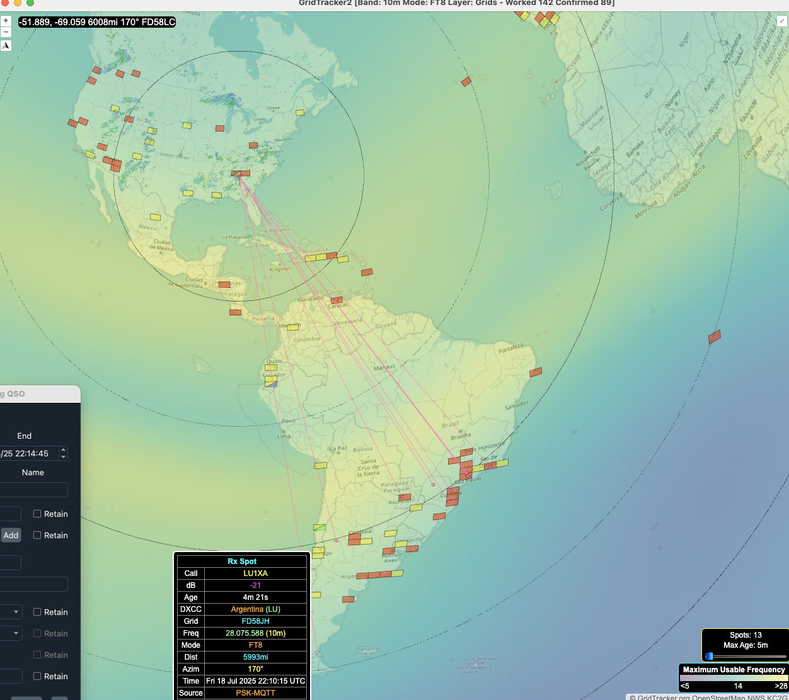
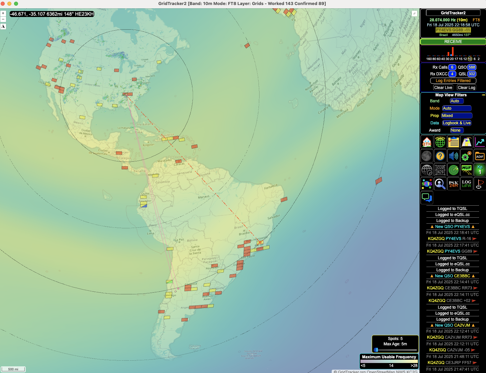
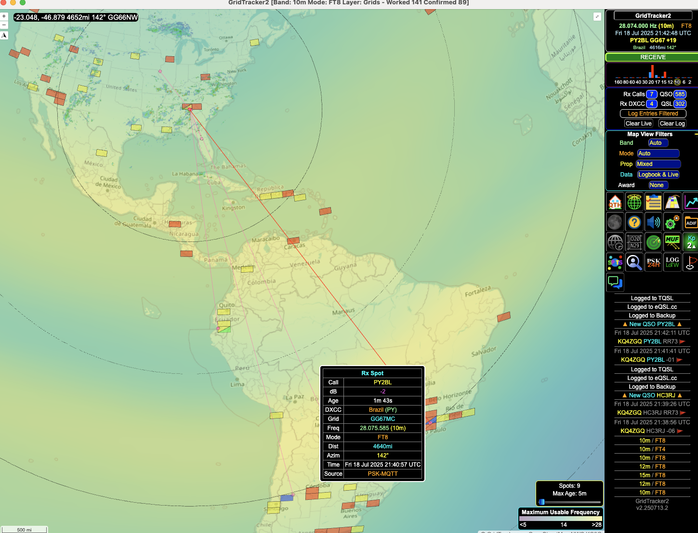
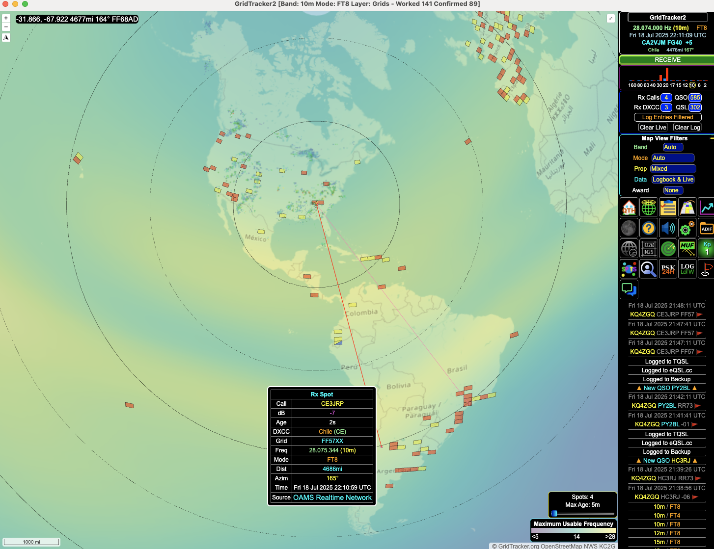
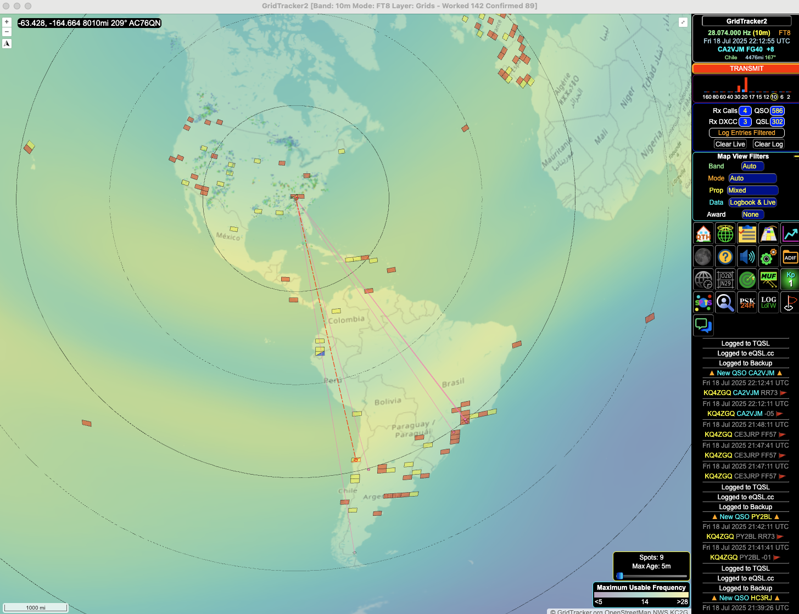
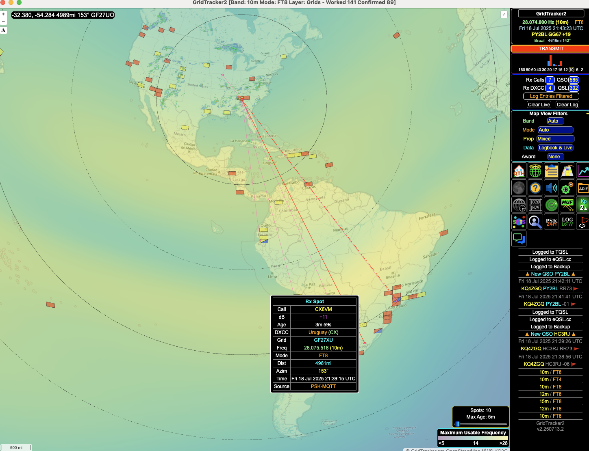
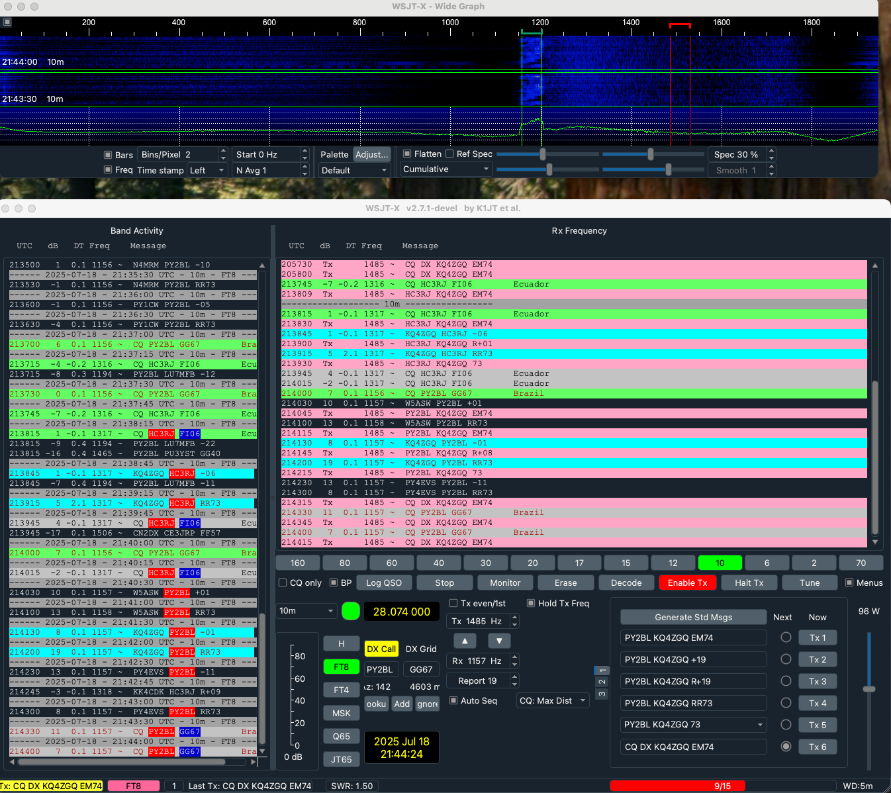

# Testing

## Test details

Test date:

Antenna height: On mast 162+150 inches AGL

## South America GridTracker2 Screenshots

### Argentina

Figure 1. GridTracker2 display showing radio signal paths between North America and South America. Antenna signal picked up by LU1XA, including signal strength, frequency, distance, and time.

Figure 2. 

### Brazil

Figure 3.

Figure 4

### Chile

Figure 5. 

Figure 6.

### Ecuador

Figure 7.

### Uruguay
Figure  8. 

## WSJT-X QSOs

Figure 9. 

