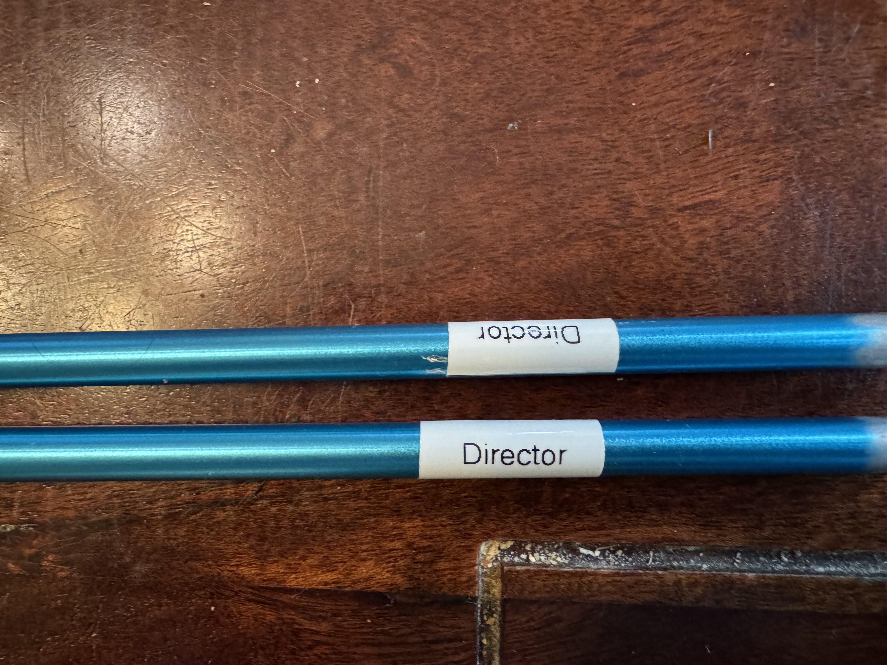
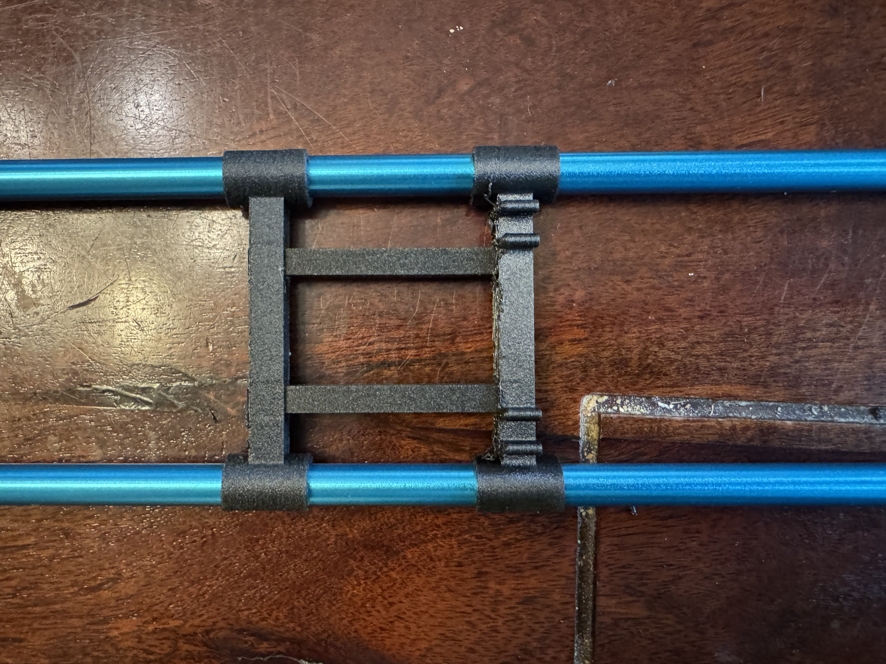
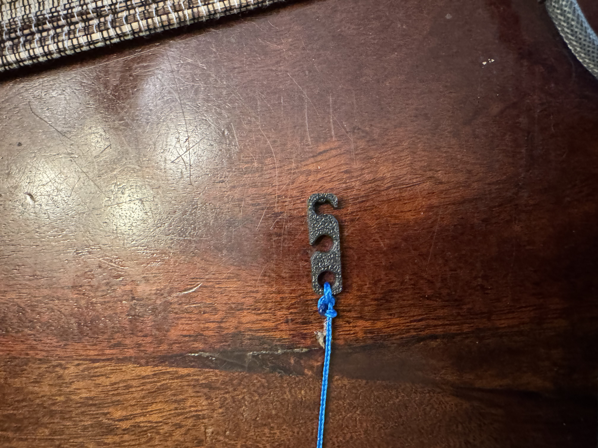
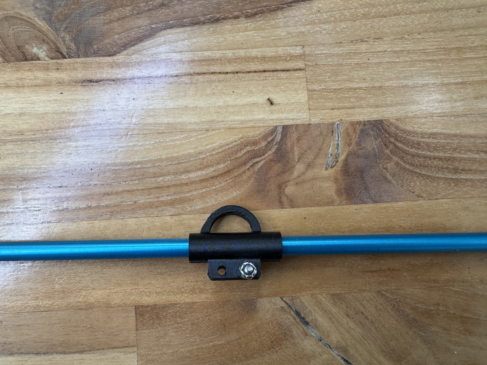
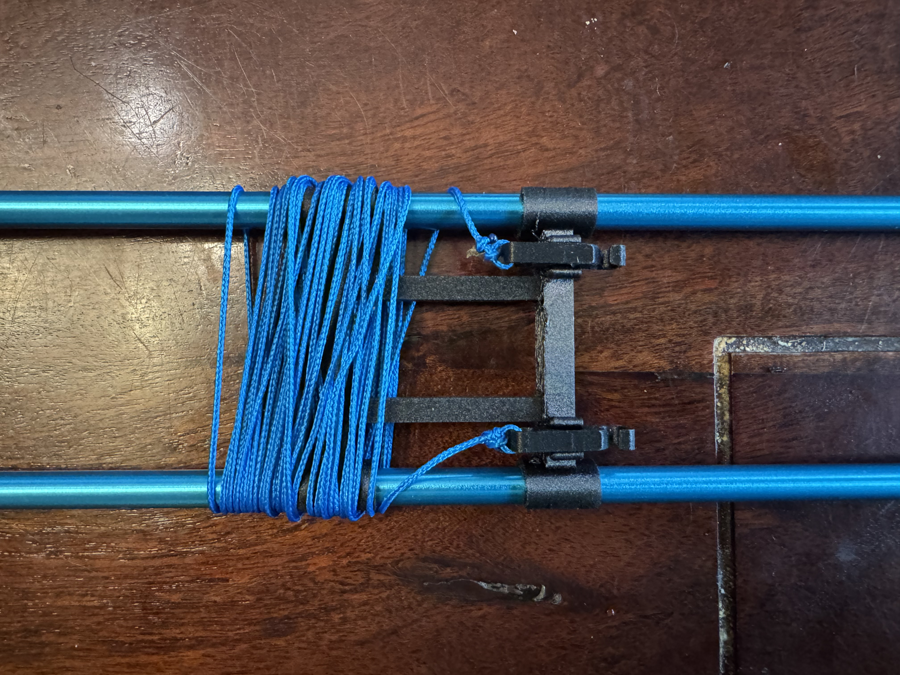

# Truss

## Setting up the truss mast
1. Cut arrow shaft to 15-inch length x 6
2. Label the masts for each element.

 

3. Attach the truss clamp assembly to the mast pair for each element.

 

## Setting up the paracord

### Paracord and tensioner

1. Cut paracord to lengths corresponding to the elements below:

| Element     | Length, inches |
|-------------|----------------|
| Rear-fed    | 160            |
| Forward-fed | 148            |
| Director    | 148            |

2. Attach the tensioner to the ends of each cord.

 

3. Place the cord clamp on the element half a certain distance from boom according to the table below. Fix the each element cord clamp with a 4-40 machine screw and lock nut - make sure clamps for both element halves are equidistant from the boom.

 

| Element     | Length, inches |
|-------------|----------------|
| Rear-fed    | 63             |
| Forward-fed | 61             |
| Director    | 55             |

4. During disassembly, just clip the tensioner on the mast clip to prevent accidental unwinding and messy cord tangles.

 

5. Disassembled masts with cord wrapped around each pair. 

 
